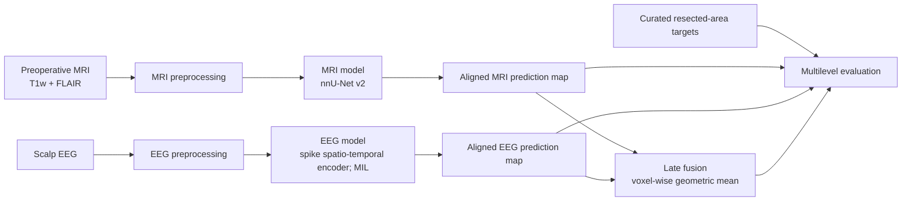

# Multimodal AI (MRI-EEG) for Focal Cortical Dysplasia Localisation

> [!WARNING]
> This repository contains research software for preoperative localisation of the resected area in focal cortical dysplasia (FCD), used here as a surrogate target for the epileptogenic zone. It is still under development and has not been externally validated, thus it should not be used to guide clinical decision-making.

## Overview

Presurgical evaluation of focal epilepsy integrates complementary structural and electrophysiological evidence. This project investigates whether structural MRI and scalp EEG can likewise be combined computationally to lay the groundwork for multimodal AI as an objective clinical support tool in this field.

Separate MRI and EEG models generate three-dimensional prediction maps in a shared template space. The primary evaluated workflow subsequently combines these maps through parameter-free voxel-wise geometric averaging. This project is very much still under construction and we are currently planning on implementing more expressive fusion methods and improving explainability.

## Proof-of-concept results

In the associated internally evaluated study, late fusion was assessed in **65 patients with paired MRI and EEG** using pooled out-of-fold predictions from tenfold cross-validation. Compared with MRI alone, geometric-mean fusion increased precision and Dice similarity while reducing the false-positive cluster burden without reducing the subject-level detection rate.

| Metric | MRI-only | MRI + EEG late fusion |
|---|---:|---:|
| Voxel precision | 0.34 | 0.45 |
| Voxel recall | 0.37 | 0.39 |
| Voxel Dice similarity coefficient | 0.31 | 0.36 |
| Detection F1 score | 0.49 | 0.68 |
| Pinpointing F1 score | 0.43 | 0.65 |
| Detection false-positive clusters per subject | 2.60 | 1.17 |

These results are exploratory and internally evaluated in a selected single-centre cohort. They do not establish external generalisability, clinical accuracy, or utility for individual patients.



## Repository layout

```text
multimodalAI_FCD/
├── datasets/          # PyTorch datasets, collate functions, and augmentation
├── evaluate/          # Map evaluation and result plotting
├── inference/         # EEG inference and DICOM-to-NIfTI utilities
├── models/            # EEG and experimental multimodal model definitions
├── preprocessing/     # MRI, EEG, target-mask, and split-generation workflows
├── scripts_misc/      # Data curation, BIDS, QC, plotting, and project utilities
├── training/          # EEG and multimodal training entry points
├── util/              # Configuration, early stopping, debugging, and run fingerprints
├── config.json.example
└── LICENSE
```

`training/eeg_spike_mil_mh_training.py` is the primary EEG-localisation training entry point. Older EEG scripts and alternative multimodal fusion implementations are retained for development traceability and should be regarded as exploratory unless explicitly documented otherwise.

## Methodological summary

### MRI

The MRI branch receives paired **T1-weighted** and **FLAIR** images as separate input channels. Model training, validation, inference, and fold ensembling are performed using [nnU-Net v2](https://github.com/MIC-DKFZ/nnUNet).

### EEG

The EEG branch represents each subject as a bag of automatically detected spike-centred epochs from a standardised 21-channel montage:

```text
Fp1, Fp2, F9, F10, F7, F3, Fz, F4, F8, T7, C3,
Cz, C4, T8, P7, P3, Pz, P4, P8, O1, O2
```

Each epoch is processed by a multiscale temporal CNN. A static distance-weighted k-nearest-neighbour graph provides early spatial mixing between channels. Spike embeddings are pooled at patient level and projected through a three-dimensional deconvolutional head to generate a smooth EEG localisation map.

### Multimodal fusion

For the primary analysis, aligned MRI and EEG prediction maps are combined voxel-wise:

```math
\hat{y}_{\mathrm{MM}}(v) =
\sqrt{\hat{y}_{\mathrm{MRI}}(v) \cdot \hat{y}_{\mathrm{EEG}}(v)}
```

This parameter-free rule reinforces spatially concordant evidence from both modalities. It is not equivalent to a learned multimodal model.

The repository also retains prior-channel, FiLM-conditioned, gated, and learned output-fusion variants. Those are either depreciated or work in progress, and have not been evaluated yet.

## Data and access

No clinical data, labels, pre-trained weights, or participant-level metadata are distributed with this repository. The codebase does contain all required scripts for preprocessing but has some institute-specific assumptions.

## Installation

This repository does not currently provide a pinned environment, public test dataset, or end-to-end reproducibility script.

```bash
git clone https://github.com/shaverschuren/multimodalAI_FCD.git
cd multimodalAI_FCD

python -m venv .venv
source .venv/bin/activate  # Windows PowerShell: .venv\Scripts\Activate.ps1
python -m pip install --upgrade pip

# Install a CUDA-compatible PyTorch build first.
python -m pip install \
  nnunetv2 numpy scipy pandas scikit-learn nibabel matplotlib tqdm \
  tensorboard mne simpleitk dynamic-network-architectures
```

A CUDA-capable GPU is strongly recommended for model training. MRI preprocessing additionally depends on external neuroimaging software, notably ANTs and HD-BET. EEG processing may require FieldTrip/MATLAB, Persyst, or centre-specific conversion tools; these are not bundled with the repository.

Create a local configuration file where required:

```bash
cp config.json.example config.json
```

```json
{
  "data_root": "/absolute/path/to/project-data"
}
```

## Suggested workflow

### 1. Prepare the data

1. Define subject-level train, validation, and test partitions before model development.
   
`preprocessing/dataset_split.py`
  
2. Preprocess T1w and FLAIR MRI and export them in [nnU-Net v2 dataset format](https://github.com/MIC-DKFZ/nnUNet/blob/master/documentation/dataset_format.md).

`preprocessing/mri`

3. Convert EEG recordings, standardise channels, detect spikes, and export patient-level spike arrays.

`preprocessing/eeg`

4. Construct or import resected-area masks and align all spatial targets to the template-space grid.

`preprocessing/gt`

### 2. Train the MRI model

Configure the standard nnU-Net v2 paths, then plan and preprocess the dataset:

```bash
export nnUNet_raw="/path/to/nnUNet_raw"
export nnUNet_preprocessed="/path/to/nnUNet_preprocessed"
export nnUNet_results="/path/to/nnUNet_results"

nnUNetv2_plan_and_preprocess \
  -d DATASET_ID \
  --verify_dataset_integrity
```

Train the required cross-validation folds using the study-specific configuration and trainer:

```bash
nnUNetv2_train \
  DATASET_ID \
  3d_fullres \
  0 \
  -tr nnUNetTrainerDA5
```

See the [official nnU-Net v2 repository](https://github.com/MIC-DKFZ/nnUNet) for full installation, dataset-preparation, training, inference, and ensembling instructions.

### 3. Train and export EEG localisation maps

The principal EEG-localisation workflow is implemented in:

```text
training/eeg_spike_mil_mh_training.py
```

Inspect the available options before starting a run:

```bash
python -m training.eeg_spike_mil_mh_training --help
```

For inference with a saved checkpoint:

```bash
python -m inference.eeg_spike_mil_mh_inference \
  --checkpoint /path/to/checkpoint_best_smoothed_val_loss.pt \
  --data_dir /path/to/eeg_spike_arrays \
  --patient_ids RESP0001 RESP0002
```

### 4. Fuse aligned MRI and EEG maps

Use:

```text
training/multimodal/multimodal_late_fusion.py
```

Fuse continuous prediction maps rather than thresholded binary masks. Apply thresholding only after fusion, using the same evaluation threshold across model variants.

## Evaluation protocol

Prediction maps are evaluated at voxel, cluster, and subject levels using an FCD-specific framework adapted from:

> Walger L, Bauer T, Kügler D, et al. *A Quantitative Comparison Between Human and Artificial Intelligence in the Detection of Focal Cortical Dysplasia*. Investigative Radiology. 2025;60(4):253–259. [https://doi.org/10.1097/RLI.0000000000001125](https://doi.org/10.1097/RLI.0000000000001125)

| Level | Main quantities |
|---|---|
| **Voxel** | Precision, recall, and Dice similarity coefficient after thresholding prediction maps. |
| **Cluster** | Detection and pinpointing criteria for connected predicted components, together with precision, recall, and F1 score. |
| **Subject** | Detection rate, pinpointing rate, and false-positive clusters per subject. |

Detection is based on bounding-box overlap between a predicted cluster and the target, whereas pinpointing requires the predicted-cluster centre of mass to lie within the target mask. These are research metrics and do not constitute clinical performance guarantees.

## Citation

The associated manuscript has not yet been published. A formal project citation will be added here on publication.

## License

This project is released under the [MIT License](LICENSE).

## Generative AI assistance

Generative AI was used to assist with drafting and editing this README. The content was reviewed and revised by the project authors.
